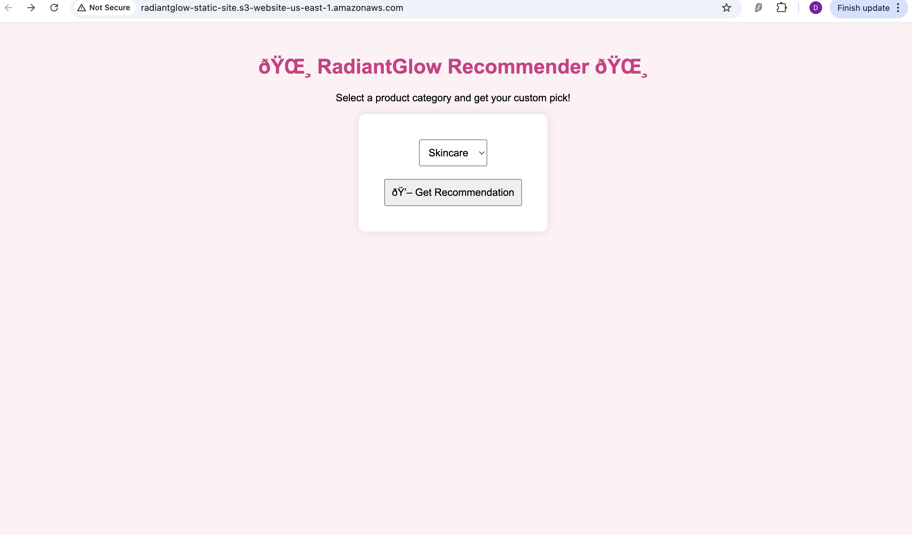

🌟 A cloud-powered skincare recommendation app using AWS S3, EC2, HTML & Flask 🌟


#  RadiantGlow Product Recommender

This is a smart skincare product recommender built with **HTML (frontend)**, hosted on **AWS S3**, and powered by a **Flask backend on EC2**.

When users choose a product category (Skincare, Haircare, Makeup, Wellness), the app returns a personalized recommendation using cloud-based logic.

---

## 🔧 Tech Stack

- 🖼️ **Frontend**: HTML + CSS (Static website hosted on AWS S3)
- ☁️ **Backend**: Python Flask API (hosted on AWS EC2)
- 📦 **Hosting**: AWS S3 (Frontend) + EC2 (Backend)
- 💻 Tools: VS Code, GitHub

---

## 🌟 Features

- Users can select from 4 product categories
- Submissions are sent to Flask backend via POST request
- Flask returns a personalized recommendation
- Simple, cute UI with soft colors and modern design

---

## 🚀 How to Run

### 🔹 Frontend
1. Open `index.html` in your browser
2. OR upload to AWS S3 to host as a static website

### 🔹 Backend
1. Launch an EC2 instance with Python & Flask installed
2. Upload and run `app.py`:
   ```bash
   python3 app.py


## 📁 Project Structure

radiantglow-recommender/ │ ├── index.html # Frontend HTML (hosted on S3 or GitHub Pages) ├── app.py # Backend Flask API (runs on EC2) ├── README.md # Project overview and documentation
## 🖼️ Preview



